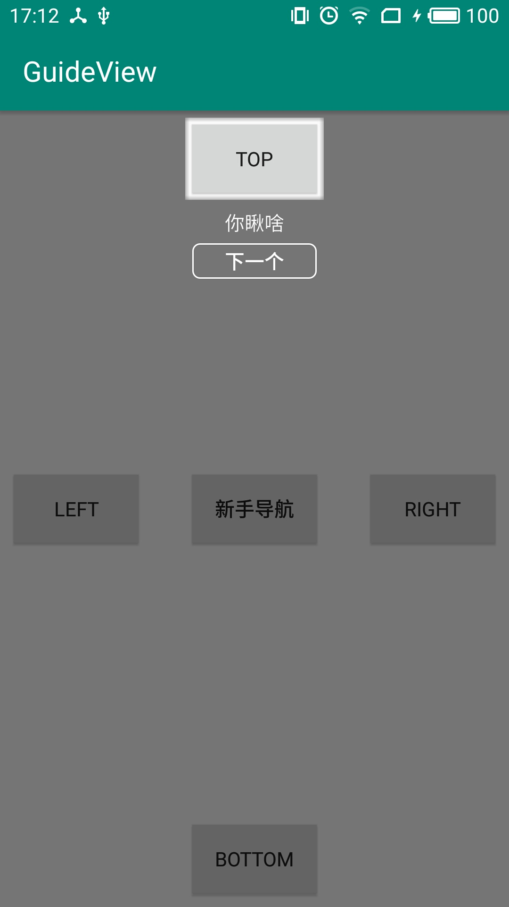

# GuideView
新手导航组件

## Effect

## Use

EasyGuide.setOn(this)
    .addRect(findViewById(R.id.btnTop), "你瞅啥", HeightLightRectVo.HeightLightTipDirection.BOTTOM)
    .addRect(findViewById(R.id.btnBottom), "瞅你咋地", HeightLightRectVo.HeightLightTipDirection.TOP)
    .addCircle(findViewById(R.id.btnLeft), "再瞅一个试试", HeightLightRectVo.HeightLightTipDirection.TOP_RIGHT)
    .addOval(findViewById(R.id.btnRight), "试试就试试", HeightLightRectVo.HeightLightTipDirection.BOTTOM_LEFT)

    //次序显示
    .showSequentially();

    //一起显示
    .showTogether();
